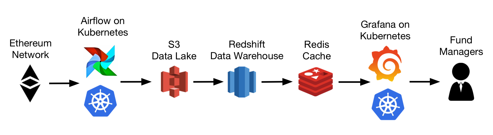
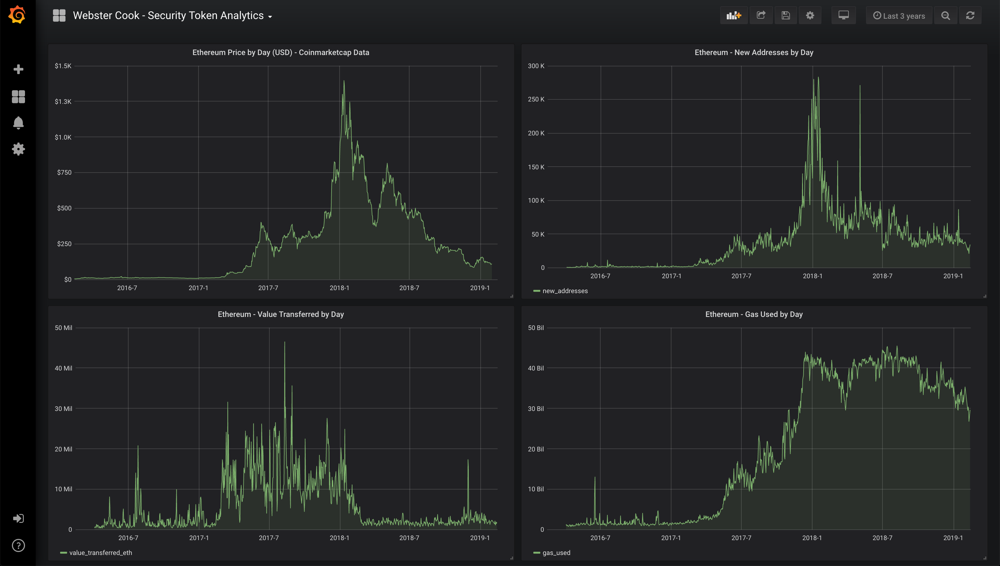

# security-token-analytics

### Overview

This project uses blockchain data to provide a platform for financial analysis 
of crypto assets.  In particular we are researching in 
emerging standards for [security tokens](https://github.com/ethereum/EIPs/issues/1411) 
and potential methods of fundamental analysis.  More broadly this project aims 
to serve as an example for how to build a data pipeline for analyzing public 
blockchains.

## Documentation

### Table of Contents
1.  [Getting Started](/docs/getting_started.md)
2.  [Terraform Configs](/terraform/README.md)
3.  [Setting up Kubernetes / EKS](/k8s/README.md)
4.  [Airflow DAGs](/airflow/README.md)
5.  [Tech Stack](/docs/tech_stack.md)
6.  [Engineering Challenges](/docs/challenges.md)

### High-level Architecture

### Example Dashboard

