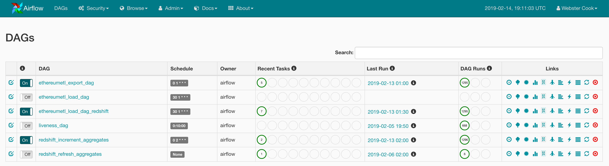

#### DAGs Overview

1.  [ethereum_etl_export_dag](https://github.com/iter-io/ethereum-etl-airflow/blob/feature-aws/dags/export_dag.py) -
    Runs the [ethereum-etl library](https://github.com/blockchain-etl/ethereum-etl) 
    to export blockchain data into CSV and JSON files.  These files are then uploaded 
    to S3.

2. [ethereum_etl_load_dag_redshift](https://github.com/iter-io/ethereum-etl-airflow/blob/feature-aws/dags/load_dag_redshift.py) - 
   Uses the Redshift [COPY command](https://docs.aws.amazon.com/redshift/latest/dg/r_COPY.html) 
   to load files from S3 into Redshift.

3. [redshift_increment_aggregates](https://github.com/iter-io/security-token-analytics/blob/master/airflow/dags/redshift/dags/increment_aggregates.py) - 
   Executes [SQL queries](https://github.com/iter-io/security-token-analytics/tree/master/airflow/dags/redshift/sql/increment) 
   in Redshift for incrementally updating the aggregate data models.

4. [redshift_refresh_aggregates](https://github.com/iter-io/security-token-analytics/blob/master/airflow/dags/redshift/dags/refresh_aggregates.py) - 
   Executes [SQL queries](https://github.com/iter-io/security-token-analytics/tree/master/airflow/dags/redshift/sql/refresh) 
   in Redshift for doing a full refresh the aggregate data models.  We keep 
   this DAG off but can manually trigger it to rebuild the tables if necessary.

#### Why the DAGs are not combined

The original export and load DAGs are separated because the export 
DAG produces single partitions while the load DAG imported all partitions into 
BigQuery.  A secondary goal of this project is to contribute back to the 
blockchain-etl project as opposed to forking it.  So it made sense to keep them 
separated for now. 

DAGs #1-2 will be included in the pull request while DAGs #3-4 will remain in this 
project. After getting feedback on the pull request then DAGs #1-3 will probably 
be combined into one (or run as subdags). 

#### Airflow build

The [Dockerfile](https://github.com/iter-io/security-token-analytics/blob/master/Dockerfile) 
in the root of this repository is used to build a Docker image for Airflow that 
contains all dependencies and DAGs. This same image is used for the scheduler, 
webserver, and workers.  In order to have the latest Kubernetes features, this 
build uses the [master branch](https://github.com/apache/airflow/tree/master) for 
airflow instead of a tagged release.

Info on the frontend npm build:

https://github.com/apache/airflow/blob/master/CONTRIBUTING.md#setting-up-the-node--npm-javascript-environment
