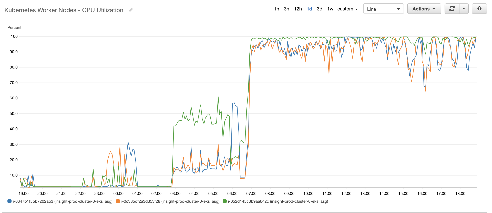
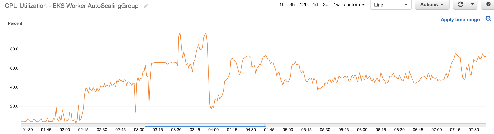
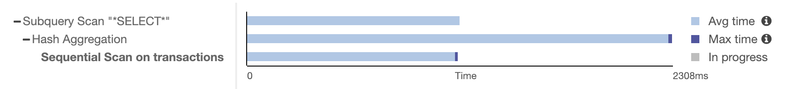
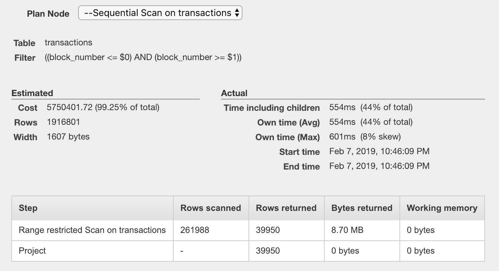

## Engineering Challenges

#### Scalability / Resource Utilization

Exporting historical blockchain data requires scaling the Airflow / Kubernetes 
cluster.  On our first run utilizing 3 x m4.large instances, it took 4 days to
export the Ethereum blockchain at a rate of 10 GB / hour.  The Kubernetes nodes 
were fully utilizing CPU resources during that time:



This was handled by scaling the Kubernetes cluster and increasing concurrency 
of Airflow workers.  The following parameters were modified in the Airflow 
configuration:

```
# The amount of parallelism as a setting to the executor. This defines
# the max number of task instances that should run simultaneously
# on this airflow installation
parallelism = 128

# The number of task instances allowed to run concurrently by the scheduler
dag_concurrency = 128

# The maximum number of active DAG runs per DAG
max_active_runs_per_dag = 128
```

And a "target tracking" EC2 autoscaling policy was implemented using Terraform:

```
#
#  Scales the EKS Worker autoscaling group based on CPU utilization
#
resource "aws_autoscaling_policy" "eks_workers" {
  name                      = "${var.project}-${var.environment}-eks-worker-cpu-target-tracking"
  autoscaling_group_name    = "${element(module.eks.workers_asg_names, 0)}"
  adjustment_type           = "ChangeInCapacity"
  policy_type               = "TargetTrackingScaling"
  estimated_instance_warmup = 300

  target_tracking_configuration {
    predefined_metric_specification {
      predefined_metric_type = "ASGAverageCPUUtilization"
    }
    target_value = 70.0
  }
}

```

This mechanism was used to temporarily scale from 3 to 10 EC2 instances while 
exporting the historical data.  In this case it took 10 hours at 100 GB / hour.
This chart shows the ramp up in CPU usage followed by a drop when the scaling 
occurs:



Once the historical data is exported, the additional nodes are removed from the 
cluster to reduce costs.

The latency of the scheduler made it difficult to reach the CPU target of 70% 
(i.e. the scheduler couldn't launch tasks quick enough).  Apparently the latency
can be decreased by changing config settings such as `scheduler_heartbeat_sec`. 
But this requires additional testing.

Another open problem is having the Airflow scheduler backoff if spawning 
additional tasks will exceed the cluster's resource capacity.  Running a large 
number of idle nodes will lead to unacceptable costs.  Furthermore, the 
Kubernetes API appears to drop requests when cluster resources are exhausted. 
This can cause issues when additional nodes are attempting to join the cluster.


#### DAG deployments

There are operational trade-offs associated with the DAG deployment process.
The following methodologies are most prevalent:

1. Syncing a shared volume with remote storage such as git or S3
2. "Pre-baked" DAGs deployed w/ the airflow container.

Our implementation uses "pre-baked" DAGs and the `dags_in_image` configuration 
options.  The motivation here is to avoid errors related to syncing files at 
runtime.  The downside is that this approach is unlikely to scale as well in 
large organization with thousands of DAGs.


#### DAG task visibility

The initial version of this project used the 
[KubernetesPodOperator](https://airflow.apache.org/kubernetes.html?highlight=kubernetes%20pod%20operator#airflow.contrib.operators.kubernetes_pod_operator.KubernetesPodOperator)
to spin up ethereum-etl containers.  The intention was to avoid mixing code for 
orchestration and blockchain data export.  With a specialized container for 
exporting data from each blockchain (Bitcoin, Ethereum, Monero, etc).  
Dependencies for each blockchain export would be managed separately and debugging
would be simplified.
 
Although this approach could allow a large development team to collaborate more 
easily, the downside is that Airflow has limited visibility into the processes 
running within the container.  For example, a container could run 3 steps of 
the data export and 2nd could fail.  But it could still show up in Airflow 
as successful and not trigger any alerts.

Since the ethereum-etl container didn't have clear success/failure exit
statuses that would bubble up to Airflow, it made more sense to 
[fork](https://github.com/iter-io/ethereum-etl-airflow) the ethereum-etl-airflow 
project and run tasks using the Python Operator / Kubernetes Executor.  This 
task visibility trade-off also motivated the use of raw SQL for updating Redshift 
tables instead of using [DBT](https://www.getdbt.com/).


#### Incremental updates in Redshift

Our use case requires joining and aggregating time series data to create metrics
for end users.  For example, we need to aggregate blocks and transactions then
join the result.  This is expensive because the transactions table is ~400 million 
rows and growing.  Using a single "dense storage" Redshift node (ds2.xlarge), it 
takes about an hour to aggregate and join the full historical dataset.

We cannot cost effectively do a full refresh on these data models many times per 
day.  So it's necessary to incrementally update them as the data is ingested.

Initially the incremental update on one day of data had a runtime of ~20 minutes 
due to a sequential scan on the transactions table.  This would grow linearly 
with the size of the table. The performance of this query was improved by selecting 
appropriate sortkeys for the blocks and transactions tables.  The `timestamp` column 
is used as a sortkey on the blocks table and the block_number is used as a sortkey 
on the transactions table.  After reloading the tables with these sorkeys in place,
the incremental update on one day of data had a runtime of 2 minutes (10x improvement).



 


#### Data security

There is a growing demand for joining public blockchain data on proprietary 
datasets.  As a result security features must be sufficient for protecting 
proprietary data stored on the platform.

During the initial setup of Kubernetes / EKS, we identified the need to 
place some Kubernetes services in public subnet with load balancers 
accessible from the public internet (e.g. ethereum nodes).  While other 
services should run within a private subnet with internal load balancers 
(e.g. Airflow).

This information was used as a reference for setting up annotations to 
select a subnet:

* https://github.com/kubernetes/kubernetes/pull/22064/files#diff-07ba008af9c76b0539556ff7fde3105eR62
* https://github.com/terraform-aws-modules/terraform-aws-eks/issues/15

We specifically expect security issues related to protecting our network 
while receiving data on our blockchain nodes.  Running these nodes will 
announce our endponts to potential adversaries.  In the event one of our
nodes are compromised, we must control access to services such as S3 and
the Kubernetes cluster management API.  These policies are implemented 
using Kubernetes RBAC and AWS IAM role configuration.


